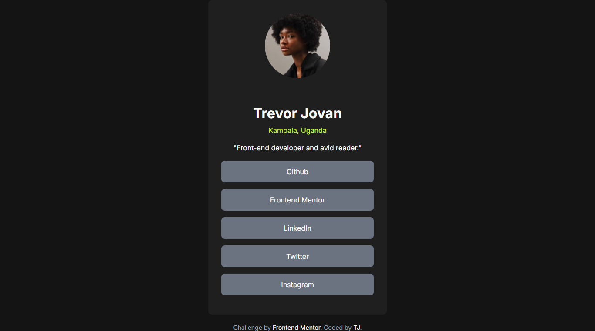

# Frontend Mentor - Social links profile solution

This is a solution to the [Social links profile challenge on Frontend Mentor](https://www.frontendmentor.io/challenges/social-links-profile-UG32l9m6dQ). Frontend Mentor challenges help you improve your coding skills by building realistic projects. 

## Table of contents

- [Overview](#overview)
  - [The challenge](#the-challenge)
  - [Screenshot](#screenshot)
  - [Links](#links)
- [My process](#my-process)
  - [Built with](#built-with)
  - [What I learned](#what-i-learned)
  - [Continued development](#continued-development)
  - [Useful resources](#useful-resources)
- [Author](#author)
- [Acknowledgments](#acknowledgments)

## Overview

### Screenshot

### Links

- Solution URL: (https://your-solution-url.com)
- Live Site URL: (https://your-live-site-url.com)

## My process

### Built with

- Semantic HTML5 markup
- CSS custom properties
- Flexbox
- CSS Grid

### What I learned

I learned to use a flex direction to improve my cssgrid layout

### Continued development

I want to contiune to learn CSS styling cause I still struggle alot with it.

### Useful resources

- (https://www.w3schools.com/) - This helped me for learn flex directions and css grid layouts

## Author

- Website - [Jovan Trevor](https://tj-wo.github.io/)
- Frontend Mentor - [@Tj-wo](https://www.frontendmentor.io/profile/Tj-wo)

